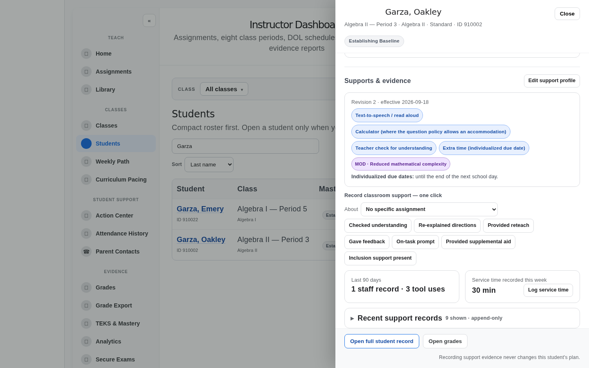
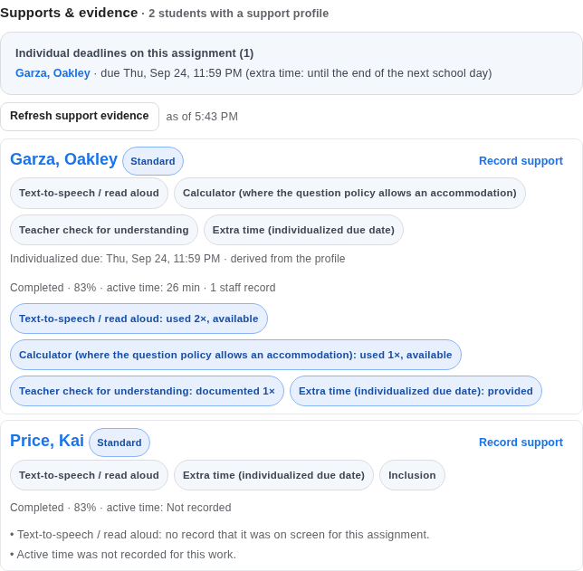
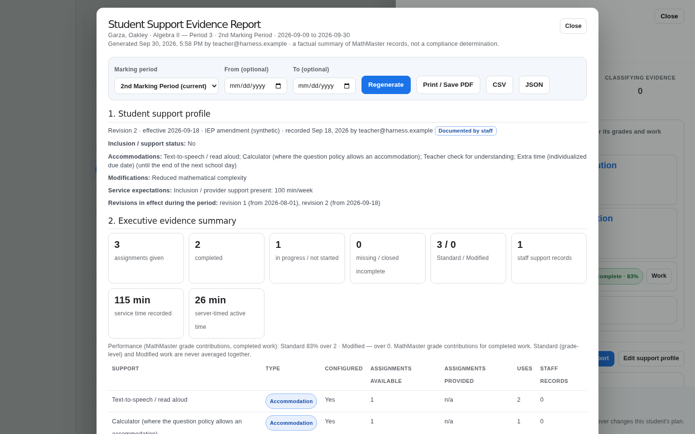
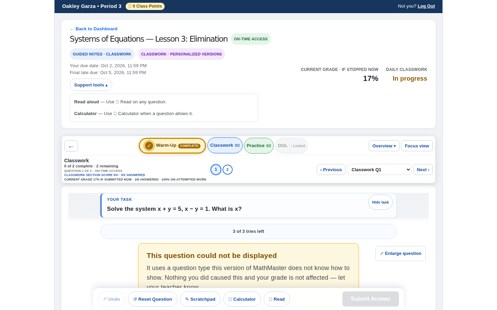
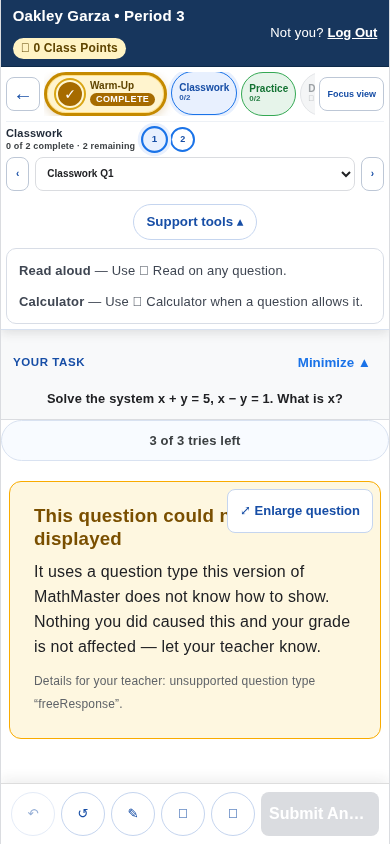
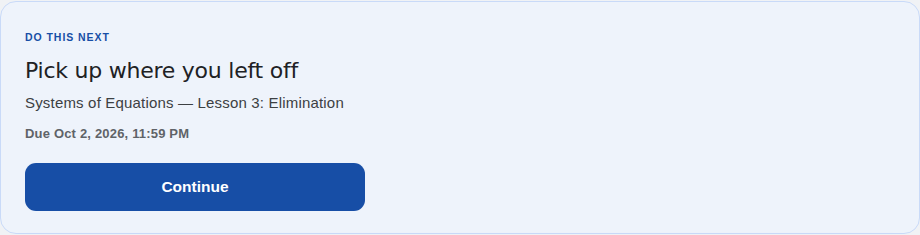

# PR #401 — Student Support Evidence: browser QA

**Branch:** `ai/claude-iep-evidence-20260930` · **Reviewer:** Claude · **Date:** 2026-09-30 (final run 2026-10-01)

Everything here ran in the in-memory **fake-school harness** (`tests/browser/teacherWorkflow/`): synthetic students, synthetic teacher (`teacher@harness.example`), no Firebase project, no network writes.
- No production data was opened, read or written.
- Every screenshot below is of the fake school.

## How to reproduce

```bash
npx vite --config tests/browser/teacherWorkflow/vite.config.mjs &          # :5188, in-memory Firebase
node tests/browser/teacherWorkflow/supportEvidenceJourneys.mjs              # T1–T6 + S1 at 1440 (default)
VIEWPORTS=1024x768,768x1024,390x844 node tests/browser/teacherWorkflow/supportEvidenceJourneys.mjs
ONLY=S1,T6 node tests/browser/teacherWorkflow/supportEvidenceJourneys.mjs   # some journeys
node tests/browser/teacherWorkflow/journeys.mjs                             # PR #400 journeys A–K + retry
# PLAYWRIGHT_MODULE=… CHROMIUM_PATH=… when Playwright/Chrome are not at the defaults
```

The fixture seeds two synthetic students with support profiles:
- **910002 "Garza, Oakley"** — a versioned profile (revision 1 from 2026-08-01, revision 2 from 2026-09-18), staff records, service entries and work.
- **910005 "Price, Kai"** — a pre-versioning (flat) profile with no timing data.

`?as=student&studentId=910002` signs in as the student.

## Journeys

| Journey | What it does | Checks |
| --- | --- | --- |
| T1 | Teacher opens Garza from Students; the drawer shows **Supports & evidence** | revision in effect named; modification shown separately as MOD; extra-time rule stated; "1 staff record · 3 tool uses" (the seeded withdrawn mis-click is not counted); 30 min of service this week; the roster flags supports and MOD |
| T2 | One-click **Checked understanding**, a note added afterwards, a second click withdrawn as "entered in error" | the click confirms at once; exactly one record, `teacher-documented`, with the teacher's email, empty note, no question; the note is added once with its own time; the withdrawal is a new correction record, not a delete; counts become "2 staff records · 3 tool uses" |
| T3 | **Log service time**: 25 min | the dialog says it doesn't measure services or determine compliance; "This week: 55 min recorded" beside the plan's 100 min/week; the entry stores its author; Escape closes the dialog, not the drawer |
| T4 | Assignment hub, **Supports & evidence** layer | both supported students listed; the extra-time deadline listed; Garza is Standard (the configured modification changed no item of this lesson); active time 26 min; "Read aloud: used 2×, available"; the pre-versioning student reads "active time: Not recorded" |
| T5 | **Edit support profile**: revision 3 adds graph paper, source "ARD amendment (synthetic)" | exactly one new revision, and earlier revisions byte-for-byte unchanged; source, author and time recorded; the student-readable projection follows with no privileged source text; "Saved as a new revision" |
| T6 | **Support evidence report** for the current marking period | all 7 section headings; an unassigned library copy never appears; no "0 min" for unrecorded time; "not a compliance determination"; Standard and Modified never averaged together; CSV named by student and dates, with the expected header; printing hides the controls; Close returns to the drawer |
| S1 | Student signs in, checks Home, Assignments, Grades and a result screen, opens the assignment, opens **Support tools**, uses Read aloud | "Your due date" on the dashboard; the Home **"Do this next"** card, the Resume card, the **Assignments** and **Grades** rows, the **assignment result** and (wherever the layout shows it) the header all name the same date, and it is not the class due date; no program or classification words; exactly one Support tools panel reachable at every width; records **available / provided / used** plus a server-timed ledger minute, all platform telemetry (no note, no staff author) |

Every journey also checks for no page errors and no sideways scroll.

## Results (final run, commit `4341b42a`)

All on a freshly started harness, one run at a time (2026-10-01, cloud container, browser zone UTC):

| Suite | Viewports | Result |
| --- | --- | --- |
| `supportEvidenceJourneys.mjs`, T1–T6 + S1 | 1440×900, 1024×768, 768×1024, 390×844 | **28 / 28 pass** |
| `supportEvidenceJourneys.mjs`, S1 only (targeted) | 844×390, phone landscape | pass |
| PR #400 `journeys.mjs`, A–K + retry | 1440×900, 1024×768, 768×1024 | **36 / 36 pass** |

The S1 due-date checks were mutation-checked in the browser. Each change below, made alone, turned S1 red with a finding naming the screen:
- the "Do this next" card printing the class date;
- the Assignments rows copying the class dates;
- the Grade Center entries copying the class dates. This also turned the result screen red.

The earlier run at `70ff9700` had the same totals.

## Problems found in the browser and fixed on this PR

| Found | Fix |
| --- | --- |
| A question-less support use was stored as question 0 (`Number(null) === 0`) | `questionIndex` stays null. Unit test added. |
| A report gap said support was "not provided" when it simply wasn't recorded here | Reworded to "Support given outside MathMaster is not recorded here." |
| On phones and portrait tablets the assignment header (and so Support tools) is hidden by the existing mobile design | The same panel renders in the expanded navigator under exactly those media conditions. Contract test added; S1 runs at 390×844. |
| Four student surfaces printed the class due date ("Due Oct 1") for a student whose own due date was Oct 2: the Home **"Do this next"** card, the **Assignments** tab, the **Grades** tab and the **assignment result** | Their models now take the dates from the student's own lifecycle (`studentDueDates`, beside `studentDueDateLines`), and `resolveNextAction` carries the date with the decision. The same fix covers attendance extensions on late and closed rows. Unit tests in `studentIndividualizedDueDates.test.mjs`; S1 compares all six places and rejects the class date. |
| Harness listed `grades/{id}/…` subcollection documents as students | Fake `listSignInAccess` lists roster rows only |
| Fake Firestore lacked `arrayUnion` / `arrayRemove` (engagement ledger) | Added with merge semantics |

## Screenshots (fake school)

| | |
| --- | --- |
|  | **Student drawer** — profile in effect, MOD tag, individualized due-date rule, one-click actions, counts, service minutes this week |
|  | **Assignment hub** — individual deadlines on this assignment; evidence rows (Read aloud used 2×, staff record, extra time provided); the pre-versioning student shows "Active time was not recorded", never 0 min |
|  | **Student Support Evidence Report** — profile with source and revision, executive summary with Standard / Modified kept apart |
|  | **Student, laptop** — own due date and Support tools in neutral words |
|  | **Student, phone** — Support tools in the expanded navigator |
|  | **Student, Home** — "Do this next" names the student's own due date (Oct 2; the class date is Oct 1). Captured in the school's time zone. |

## Not covered here

- **Real Firebase.** The deployed rules are covered by the emulator suites (`npm run test:rules`, 19 new cases), not by this harness.
- **A student answering the fixture's `freeResponse` items.** The student runtime doesn't support that type, so S1 records use from Read aloud rather than from answering.
- **A pre-existing React "Maximum update depth exceeded" log** in the student assignment view under the harness. It reproduces on untouched `main`, so it is not from this PR.
