# Student UX platform pass

Branch `ai/claude-student-ux`, from `main` at `86da4e83` (PR #397 merged).
Not deployed.

This pass turns the platform-wide issues found during PR #397's student QA into
shared fixes. Each recommendation was **reproduced in a browser first**, then
classified, then fixed and re-driven. Nothing here is specific to one
assignment. Where a tool had to change, it was either adopting a shared
contract (Enter declarations, fraction entry, width profile) or the change
was the tool's own layout (Representation Match).

**How it was driven.** `tests/browser/studentUxPlatform.html` compiles one
assignment through the **teacher import chain** (parse → preflight review →
preflight model → `validateAssignmentQuestions` → `rebuildV5SectionsFromQuestions`,
as `App.jsx` does). It mounts the real `QuestionEngine` inside App.jsx's own
`mathmaster-assignment-screen` / `-shell` / `-stage` wrappers, with the real
sticky navigator whose height is measured and published. The assignment holds:

| Nav | Question | Tool |
| --- | --- | --- |
| WU 1, WU 2 | PR #397 warm-ups (lines; situations) | Representation Match |
| CW 1 | PR #397 CW2, slope-intercept GIVEN | Linear Multiple Representations board |
| CW 1 | Solve 3x − 5 = 10 | Step Algebra |
| CW 2 | Graph y = −2x + 3 | Graphing 2 |
| CW 3 | Constant rate, rate −2/3 | Linear Table Workbench |
| CW 4 | Three-part typed answer | Multi-answer |
| PR 1 | Situations with **table cards** | Representation Match |
| PR 2 | Slope through two points | ordinary single answer |
| DOL 1 | PR #397 DOL board | board, submit-only |
| DOL 1 | Slope of y = −3x + 7 | DOL / submit-only single answer |

Viewports: **1366×768** laptop, **820×1180** iPad (touch), **390×844** phone
(touch), and **1920×1080**, which is how a 1366 Chromebook zoomed out to about
70% reports itself. Reproduction scripts lived in the session scratchpad. The
regression journeys are committed as `tests/browser/studentUxPlatform.mjs`.

Limit: this is the real question runtime and the real teacher import chain.
It is **not** a signed-in student session against Firebase; no QA-student
credentials were used and nothing was written to production.

---

## Summary

| # | Recommendation | Reproduced? | Class | Outcome |
| --- | --- | --- | --- | --- |
| R-1 | Sticky action bar covering work | Yes (phone two-row bar; keypad over the field) | A | Fixed |
| R-2 | Touch-device autofocus | Yes (iPad, phone, laptop page jump) | A | Fixed |
| R-3 | MathDisplay LaTeX detection | Yes (`\ ` → blank) | A | Fixed |
| R-4 | Keys going to the previous math field | Yes (every attempt, **P0**) | A | Fixed |
| R-5 | Silent draft-sync refusal | Yes (by construction) | A | Fixed (observability + contracts) |
| R-6 | Signed values on mobile | Yes (no fraction key; ± wrote "0") | A + B | Fixed |
| R-7 | Duplicated plotting help | Partly (board had opted out; every plane 4 lines) | A | Fixed |
| R-8 | Graph lines outside the plot area | Yes | A | Fixed |
| R-9 | Representation Match layout & language, TABLE card | Yes | B | Fixed; table card added |
| R-10 | Platform jargon in student chrome | Yes | A | Fixed |
| R-11 | Repeated "Show math tools" | Yes (7 rows; phone keypads left open) | A | Fixed |
| R-12 | Enter guessing a "primary" button | Yes (8 tools submitted on the first box, **P0**) | A + B | Fixed |
| R-13 | Reduced-zoom / wide screens | Yes (`#root` is a 1126px column) | A (opt-in) + B | Fixed for multi-column tools |
| R-14 | Two Undos | Yes (platform Undo always disabled on the board) | B, with a C follow-up | Fixed for graphs; follow-up below |

Found during the pass and fixed:

- **Enter arriving before the render.** Typing "6" then Enter quickly made
  Enter do nothing. Found by the `enter` journey.
- **A focused box hidden under the phone number keypad.** The scroll helper
  was scrolling a container that cannot scroll.
- **`EnlargeableFigure` focused "Enlarge question"** on every question open.
- **± on an empty box wrote "0"**, so "±, 3" produced "03".
- **Card accessible names omitted the card's content.** A screen reader could
  not do the card sort.

Regressions this PR introduced, caught by the existing browser gates and
fixed before the PR was opened:

- **A tap on Check under a phone keypad missed** (PR #397 `phone-scenario`).
  The first version of R-11 closed the keypad on any blur, so the Check button
  moved up out from under the finger mid-tap. The keypad now closes only when
  the student moves to another field, input or select.
- **A third folded row under Sequence Explorer's plane** (tool-open audit,
  132px folded). The first version of R-7 put the keyboard help in a fold. It
  now appears while the plane has keyboard focus.

---

## R-1 · Sticky action bar covering student work

**Reproduction.**

- **Laptop:** the sticky bar is 65px (not 64). Focus scrolling used a fixed
  `scroll-padding-bottom: 90px`, which was right for one row and wrong once the
  bar wraps. At 1366×768 the first open of the DOL board left the next card's
  field under the bar (see R-2 for why the page had scrolled there).
- **Phone:** the portrait bar is **not** sticky over the work. It is a flex row
  under the workspace, so nothing sits *underneath* it, but it takes the room.
  With Submit it wrapped to **two rows, 111px of 844px**, and Submit sat alone
  on the second row.
- **Phone keypad:** MathMaster's number keypad is `position: fixed` over the
  bottom of the screen. With it open the bar was covered, and **the box being
  typed into sat under the keys**. Linear Table Workbench's slope box bottom
  was at 611 with the keypad top at 570.

**Fix.**

- The desktop bar publishes its measured height (`--mm-action-bar-height`,
  `stickyHeightRef`). The assignment's scroll padding is
  `calc(var(--mm-action-bar-height, 72px) + 18px)`, and 16px on short laptops.
  Measured: bar 65px, padding 83px. Bottom safe-area inset added to the
  desktop bar (iPad landscape).
- Phone: when Submit / Next is in the bar, the four tools show **icons only**,
  with their names kept as the accessible label (sr-only span). Submit takes
  the rest: **one 61px row**.
- While the number keypad is open the phone bar yields its row (the keypad
  covers it anyway, and Done brings it back). The workspace pads by the
  measured keypad height.
- `scrollFocusedControlVertically` treats the keypad's top as the safe bottom
  when the keypad covers the box's column, and scrolls the nearest container
  that **can** scroll. Field bottom is now 558 against a keypad top of 570.

MathLive's in-flow keypad (`.mathmaster-math-input-tools`) was evaluated
while typing. The one-row bar stays, because Submit at hand after the last
key is worth 61px. See R-11 for the keypad clutter itself.

**Files.** `MobileViewportContainer.jsx`, `MathToolMobileLayout.css`,
`App.css`, `stickyHeightRef.js`, `UniversalUndoButton.jsx`,
`QuestionEngine.jsx` (work-bar labels), `mobileFocusViewport.js`.

**Evidence.** Journeys `open-laptop` (published height = bar height, padding ≥
bar + 12 on every question) and `phone` (bar ≤ 64px with Submit, field above
the keypad, bar hidden and restored).

| Before (main): two-row bar, 111px | After: one row, 61px |
| --- | --- |
| 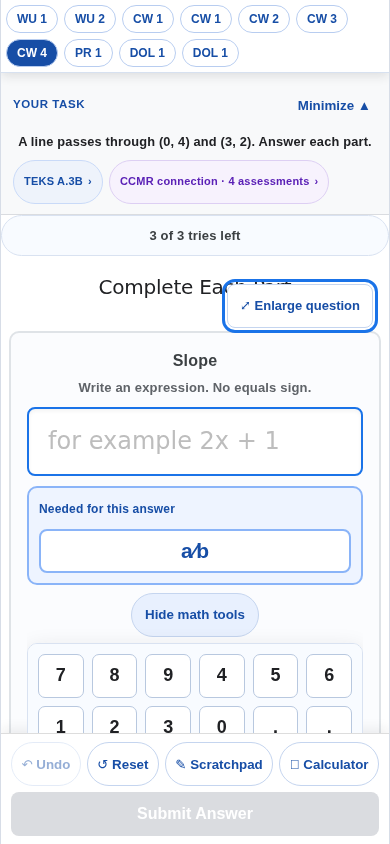 | 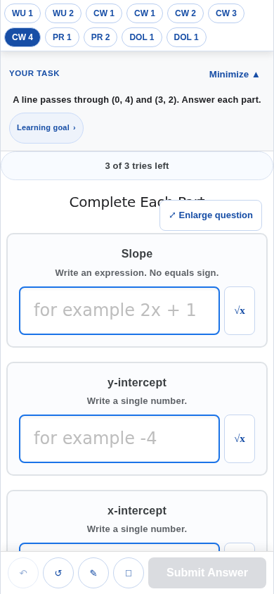 |

The −2/3 keypad with the box above the keys:
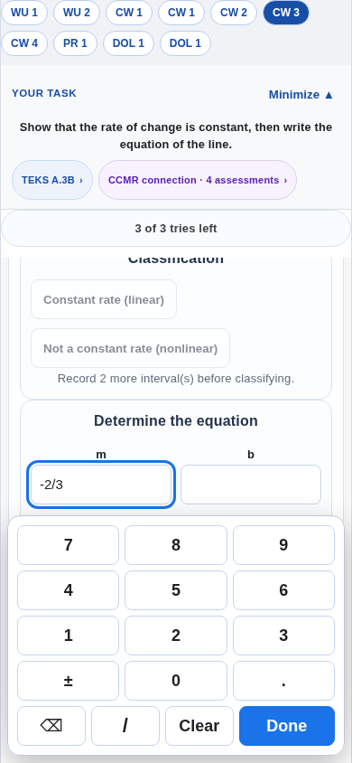

**Remaining risk.** On devices without an emoji font the calculator icon
falls back to "□". ChromeOS, iOS and Android ship one.

## R-2 · Touch-device autofocus

**Reproduction (before).**

| Viewport | Focused on open |
| --- | --- |
| iPad 820×1180 touch | board *Standard form*, the math keypad opened over half the board; LTW *Slope m*; multi-answer; ordinary answer; DOL answer |
| Phone 390×844 | LTW *Slope m*: **the number keypad opened over the table** on load. ToolShell ignored the policy QuestionEngine had already applied. |
| Laptop 1366×768 | DOL board *Standard form*. `MathfieldElement.focus()` ignores `preventScroll`, so **the page scrolled to mid-board, past the prompt**. |
| every viewport | "Enlarge question" received focus on mount (`EnlargeableFigure`'s focus-return effect ran on first render) |

**Fix.**

- `shouldFocusAnswerOnOpen` also refuses a **touch-first pointer**
  (`(hover: none) and (pointer: coarse)`). Layout still follows width, so a
  touch Chromebook with a trackpad keeps autofocus.
- `QuestionEngine` shares its decision through `AnswerFocusPolicyProvider`.
  **ToolShell obeys it**, and focuses only when the tool shows **exactly one**
  answer box (`focusOnOpen={false}` opts out). A board or table workbench has
  no "the" box.
- Autofocus on a math field focuses its keyboard sink with `preventScroll`,
  so the page no longer jumps.
- `EnlargeableFigure` returns focus only after a real close.

**After.** iPad and phone: nothing focused, no keypad, on every question.
Laptop: the multi-answer, ordinary and DOL answers open ready to type; the
board, LTW, graphs and sorts do not; every question opens at `scrollY = 0`.

**Files.** `answerEntryUx.js`, `answerFocusPolicy.js` (new),
`QuestionEngine.jsx`, `ToolShell.jsx`, `EnlargeableFigure.jsx`,
`mathFieldFocusHandoff.js`.

**Evidence.** Journeys `open-laptop` and `open-ipad`; `answerEntryUx.test.mjs`.
Measured on `main` and on this branch with the same harness:

| Scene | main | this branch |
| --- | --- | --- |
| iPad, board opens | math field focused, keypad open | nothing focused, no keypad |
| Phone, LTW opens | *Slope m* focused, number keypad open | nothing focused, no keypad |
| Laptop, DOL board opens | page at scrollY **563** | scrollY **0** |

| iPad board, main | iPad board, this branch |
| --- | --- |
| 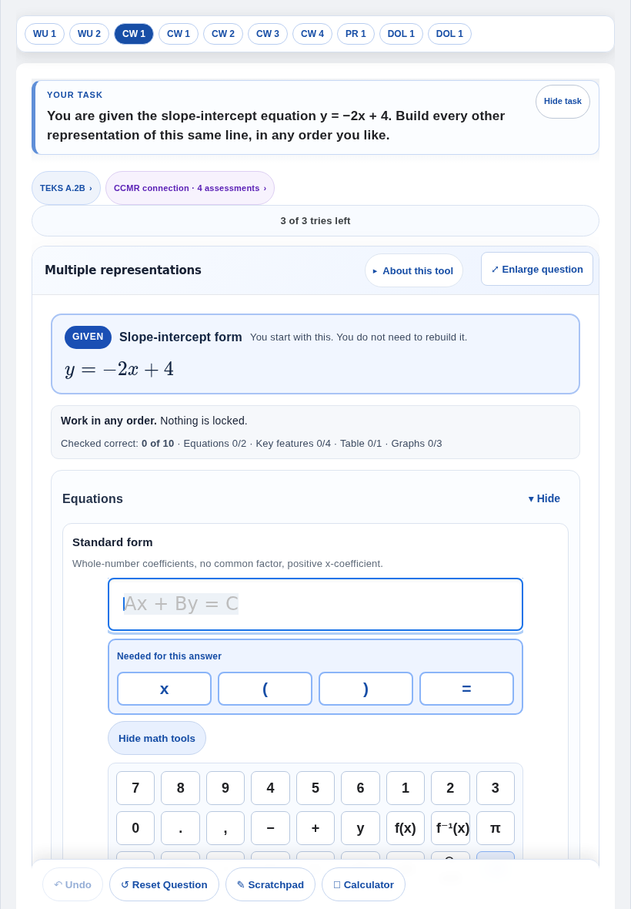 | 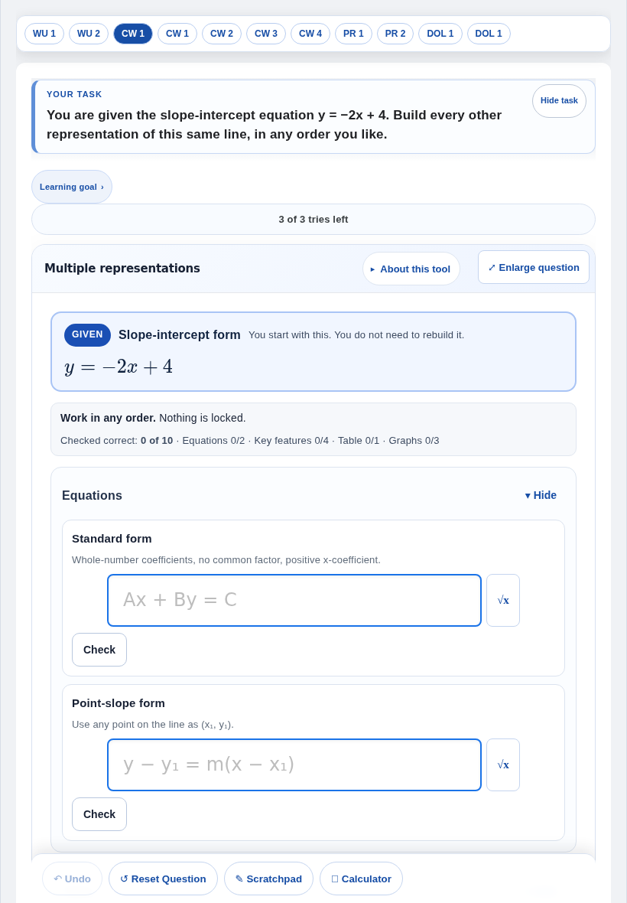 |

| Phone LTW, main | Phone LTW, this branch |
| --- | --- |
| 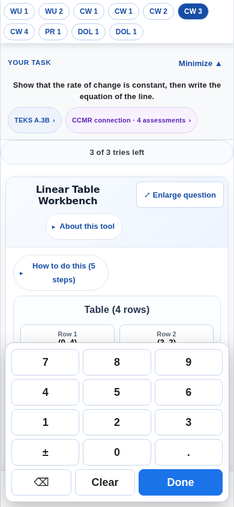 | 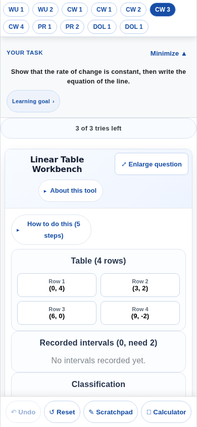 |

| Laptop DOL board, main | Laptop DOL board, this branch |
| --- | --- |
| 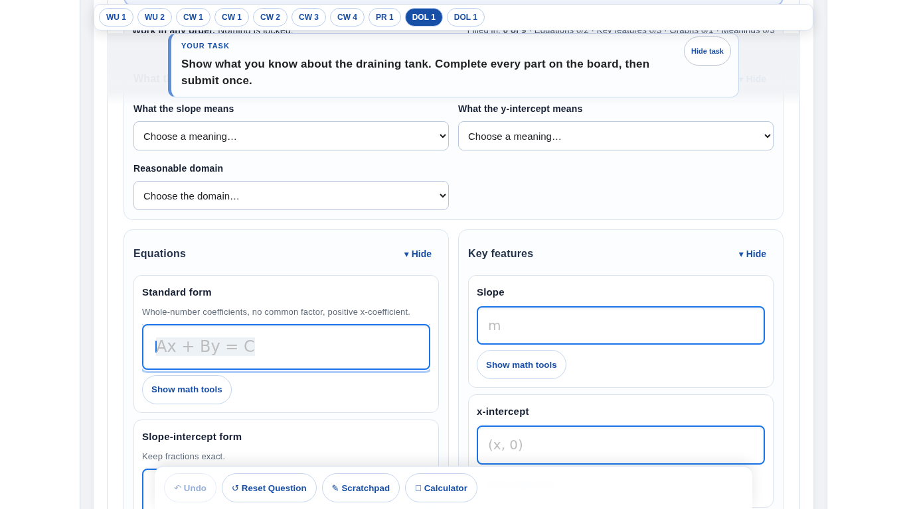 | 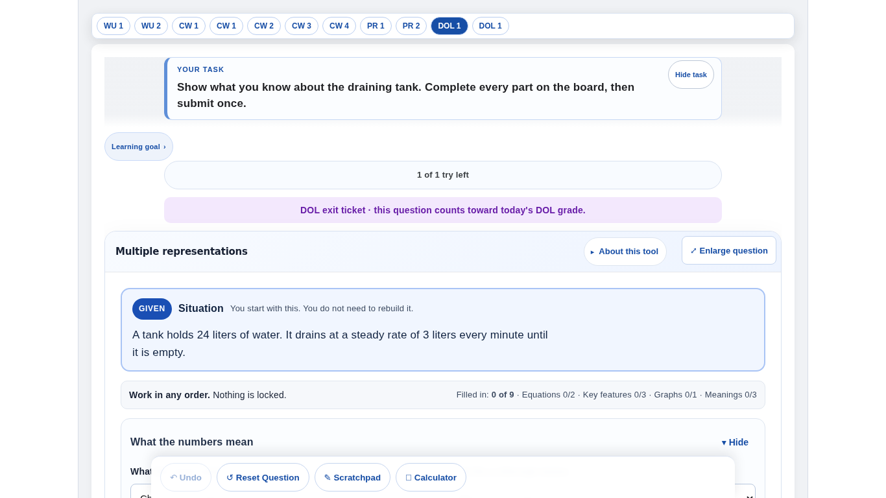 |

## R-3 · MathDisplay format detection

**Reproduction.** `resolveMathDisplayFormat('(2, -2),\\ (4, -1)')` returned
`ascii-math`. The LaTeX signal knew letter commands of two or more characters,
`\(`, `\[`, `^{` and `_{`. It did not know the control space `\ `, `\,` `\;`
`\:` `\!`, escaped set braces `\{ \}`, a `\\` line break or single-letter
commands. MathLive then failed to parse the value as ASCIIMath and rendered it
blank.

**Fix.** In the shared `mathDisplayFormat.js` (used by `MathDisplay` and so by
`MathText` and every tool): any backslash command is LaTeX, because ASCIIMath
has none. Exported `looksLikeLatex`.

**Tests.** `mathDisplayFormat.test.mjs`: control-space point lists, set braces,
thin spaces, line breaks, `\%` `\$`, and the named commands. Plain ASCII
(`(2, -2), (4, -1)`, `sqrt(x)`, `|x − 3|`) stays ASCIIMath. Two of the new
tests fail on the old detector.

## R-4 · Keys going to the previous math field (P0)

**Root cause (MathLive 0.110).** A pointerdown on a math field calls
`preventDefault()`, so the browser doesn't move focus. MathLive then marks
the field focused and focuses its hidden keyboard sink in a
`setTimeout(…, 60)`. Until that fires, the previous field's sink owns DOM
focus, and MathLive's keystroke handler does not check whether its field is
still active.

**Reproduction.** On the three-part answer: *Slope* "5", click *y-intercept*,
Backspace, 4 → `["4", "", ""]`. **The finished slope was edited and the
y-intercept left empty, on every attempt, at 1366×768 with no throttling.**
Touch was not affected, because keypad buttons insert into their own field.

**Fix** (`mathFieldFocusHandoff.js`, no timers):

1. After MathLive's own pointerdown handler (a bubble listener on the host),
   if MathLive considers the field focused but its sink doesn't own DOM focus
   yet, the sink is focused **in the same event**.
2. A keydown that still reaches a field MathLive has left is stopped before
   MathLive sees it. Focus moves to the active field, and a printable key,
   Backspace or Delete is replayed there (`typedText`, `deleteBackward`).

It's bound in `MathInput`, before its Enter/space handling, and in the
calculator's math field.

**After.** `["5", "4", "\\frac34"]` for Backspace-4 and then 3/4 typed
straight after each click, at **4× CPU throttling** (6× also checked).

**Tests.** `mathFieldFocusHandoff.test.mjs` (both mechanisms with stand-in
elements, mutation-checked); journey `rapid-switch`.

**Remaining risk.** The guard relies on MathLive's `hasFocus()` and the
`keyboard-sink` part name. A MathLive upgrade must re-run `rapid-switch`.

## R-5 · Silent draft-sync refusal

The guard (`sanitizeWorkspaceDraftValue`) is **unchanged and as strict**.

**Added.**

- `explainWorkspaceDraftRejection` names **the path of the first forbidden
  key** (`cardChecks.slope.isCorrect`, `steps[1].accepted`). For an oversized
  record it gives the largest fields and their sizes. It never changes the
  verdict (tested).
- `draftSyncDiagnostics.js`:
  - **Development and test builds** `console.error` once per key, reason and
    path **at the draft write** (`writeQuestionDraft` → `auditDraftWrite`), so
    a developer or a browser journey sees it at the keystroke that caused it,
    signed in or not.
  - **Every build:** the sync `console.warn`s once, counts refusals by reason
    (`stats().rejected`), and never queues the value.
  - **Nothing reaches the student.** A test forbids DOM, toast or React use in
    the module.
- **Registry-wide contract** (`toolDraftSyncContract.test.mjs`): no
  draft-backed tool may name a persisted field after a forbidden key, or write
  one literally into a persisted setter. That covers 100+ persisted fields and
  setter calls. Planting `isCorrect` in Linear Table Workbench's `setEvidence`
  turns it red.
- **Runtime sweep** (`tests/browser/toolDraftSyncSweep.mjs`): mounts every
  draft-backed tool under a real draft key, works it, and runs every stored
  record through the real sanitizer. It writes
  `tests/platform/fixtures/toolDraftSyncFindings.json`, which the suite asserts
  is empty **and covers every draft-backed tool**, so a new tool cannot ship
  unswept. A spread verdict planted in Sequence Explorer
  (`{ ...verdict }` with `score`), invisible to the source contract, was caught
  as `forbidden-key at difference.score`.

**Remaining risk.** The sweep's generic student taps fields, selects, planes
and Check. It reached 21 of 23 tools' records. Signs and Solutions and
Expression Meaning need drag and choice interactions it does not perform;
their records are covered by the source contract only.

## R-6 · Signed values on mobile

**Reproduction.** Inside a question a phone never saw the iPhone decimal pad,
because `MobileViewportContainer` swaps decimal boxes for MathMaster's keypad,
which has ±. But the keypad had **no fraction key**. A rate or slope of −2/3
(graded exactly; 0.667 misses the tools' 1e-6 tolerance) **could not be
entered on a phone**. Separately, ± on an empty box wrote "0", so "±, 3"
became "03". Android tablets' decimal pad has "-" but no "/".

**Fix.**

- `FRACTION_ENTRY_PROPS` (`numberEntry.js`): `type="text"` with a text
  keyboard on tablets (their number layer has - and /), and the phone keypad
  **with a fraction key**. Applied only where the parser accepts a/b
  (`parseNumericAnswer` / `compareMathAnswer`): **22 boxes** in Linear Table
  Workbench (6), the representation bridge (8), Sequence Explorer (7) and table
  questions (1). `type="number"` boxes and `Number()`-parsed boxes (e.g. Step
  Algebra 2's operand) keep their mode; ± already covers negatives there.
- The keypad's edits are one pure function: one bar, one decimal point per
  side, and ± starts a negative. A number input never receives a lone "-".

**Evidence.** Journey `phone`: ± 2 / 3 on the keypad → `-2/3` in the box and
in the saved draft. `numberEntry.test.mjs`.

## R-7 · Duplicated plotting help

**Reproduction.** Every interactive `CoordinatePlane` printed a four-line
paragraph (gesture, keyboard, zoom) under itself. Only the PR #397 board shows
several interactive planes at once, and it had already opted out by hand.

**Fix (shared).**

- The directions are **one line**: the press-and-slide gesture, plus "drag a
  point to move it".
- The keyboard sentence appears **while the plane has keyboard focus**
  (`:focus-visible`), which is when a sighted keyboard user needs it. A
  folded "Keyboard and zoom" row was tried first; it added a third fold under
  Sequence Explorer's plane and failed the tool-open audit.
- `ToolShell` opens a `PlotHelpScope`, and only the **first** interactive
  plane in a tool shows the directions.
- **Screen readers lose nothing.** Every interactive plane keeps its keyboard
  instructions in its accessible name, and its cursor readout in its live
  region.

**Evidence.** Journey `graphs`: Graphing 2 shows one set; the board none.

## R-8 · Clip graph lines to the plot area

**Reproduction.** `lines` were drawn from xMin to xMax whatever the slope, and
`functions` to ±2 units past the window. WU-1's y = 2x − 4 on −6..6 ran
through the top padding and over the axis numbers; the draining tub went
below the x-axis (screenshot `before-wu1.png`).

**Fix.** A `<clipPath>` of the plotting rectangle (url-safe id from `useId`)
wraps regions, vertical and horizontal lines, functions, lines and polylines.
**Axis numbers, points and drag handles stay outside it**, so a point on the
edge is never cut in half. Tools drawing their own curves receive `plotClip`:
Path stimulus curves and the systems inequality lines are now clipped. The
clip is in viewBox units, so it holds when enlarged, zoomed, on a mini card
and on a phone. Vertical lines were already bounded.

**Evidence.** Journey `graphs`: the student's steep line in Graphing 2 sits
inside a clip group whose rectangle equals the plot rectangle.
`coordinatePlaneClipAndHelp.test.mjs`.

| WU-1 at 1366×768, main | WU-1, this branch |
| --- | --- |
| 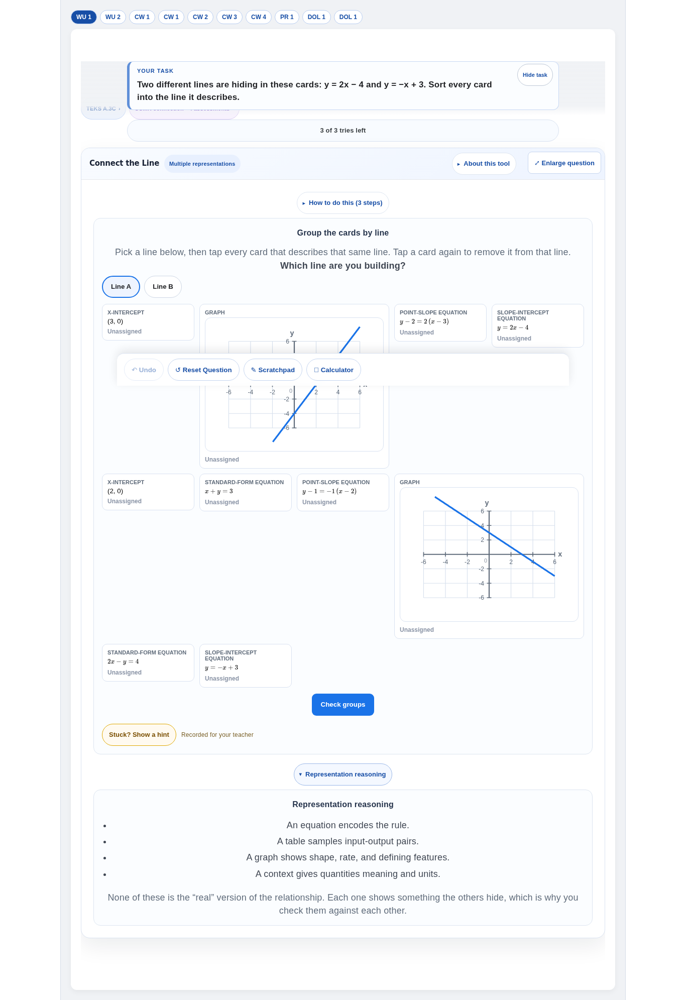 | 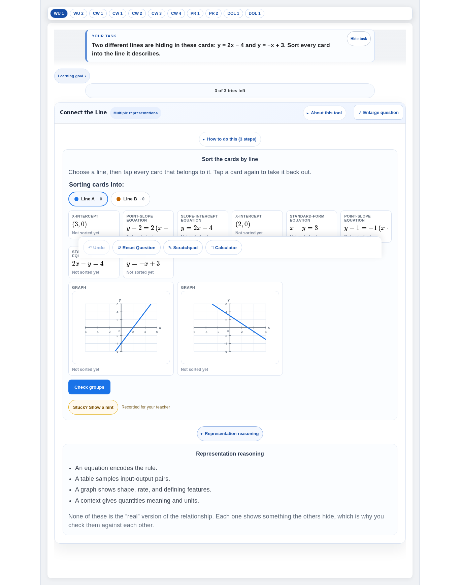 |

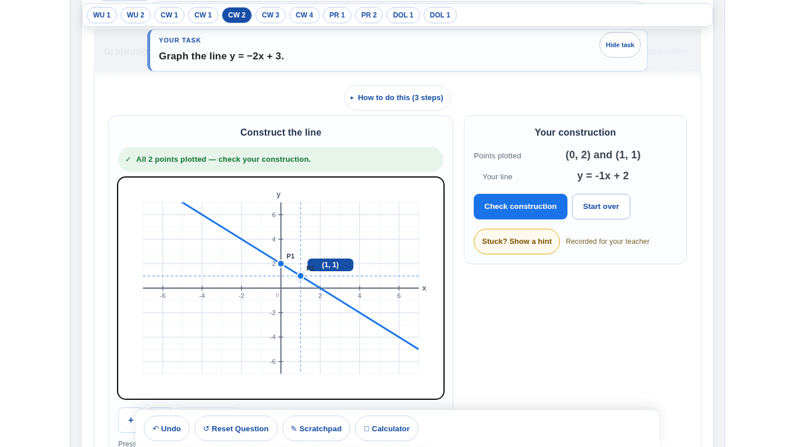

## R-9 · Representation Match: layout, language, TABLE card

**Reproduction.**

- WU-2 asks students to sort cards "into the situation it describes" under
  **"Line A / Line B"** and "Which line are you building?".
- One grid of every card made each row as tall as its graph, leaving **~250px
  of empty space** under the equation cards (`before-wu1.png`,
  `before-wu2.png`).
- Assigned cards were all the same blue, whatever their group.
- Each card's accessible name was only its kind ("Slope-intercept equation
  card, currently Unassigned"), so **a screen reader could not do the task**.
- There was no table card kind.

**Fix.**

- **Group names follow the task.** "Situation A/B" when every set is a
  context; an authored `groupNoun` or per-set `label` when given; "Line A/B"
  otherwise. The instruction, legend, panel title and feedback use the noun.
- **Bands of like size:** situations, facts (two per row on a phone), tables,
  graphs (≥ 260px wide, so axis labels stay apart). Order within a band is the
  deck's own shuffle, so nothing about the grouping is revealed.
- A colour per group on the slot buttons and sorted cards, with a card count
  on each slot.
- Accessible names include what the card says: equations verbatim, points,
  table rows, and graphs as "a line through (0, −4) and (1, −2)", the two
  lattice points nearest the y-axis.
- **TABLE card** (opt-in: only a set that authors `table` gets one, so no
  existing assignment changes):
  - 2–6 rows as `[{x, y}]` (Firestore-safe, preferred), `[[x, y]]`,
    `{ points }` (repaired to `{x, y}` on import), text pairs, or
    `{ xValues }` computed from the set's line.
  - Validated against the line like every other card, and two explicit rows
    can define the line.
  - Rendered as a compact read-only x | y grid. It's spans rather than a
    `<table>`, because it sits inside the card's button, whose name reads the
    rows.
  - `groupNoun` passes through the V5 compiler; `toolSchemas` explains a bad
    table, label or noun.
- The Representation reasoning panel is left-aligned; its bullets and centred
  sentences no longer diverge.

**After.**

| Measure (same harness) | main | this branch |
| --- | --- | --- |
| WU-1 at 1366×768, page height | 1984px | 1740px |
| WU-2 at 1366×768, page height | 1993px | 1721px |
| WU-2 phone workspace | 2182px | 2018px |

Grading is unchanged; the partition is scored, not the slot names (tested).

**Evidence.** Journey `sort`: the table-card sort done on a phone from the
cards' accessible names alone, then graded correct.
`representationMatchStudentUx.test.mjs`.

| WU-2 at 1366×768, main | WU-2, this branch |
| --- | --- |
| 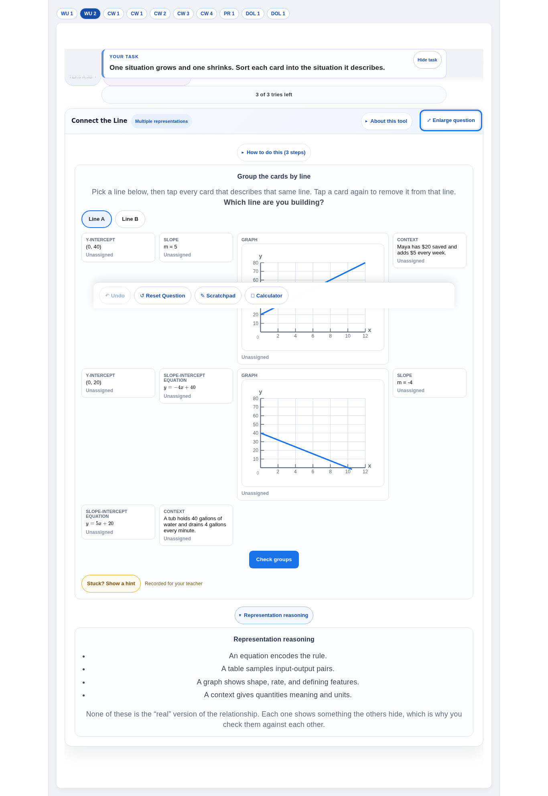 | 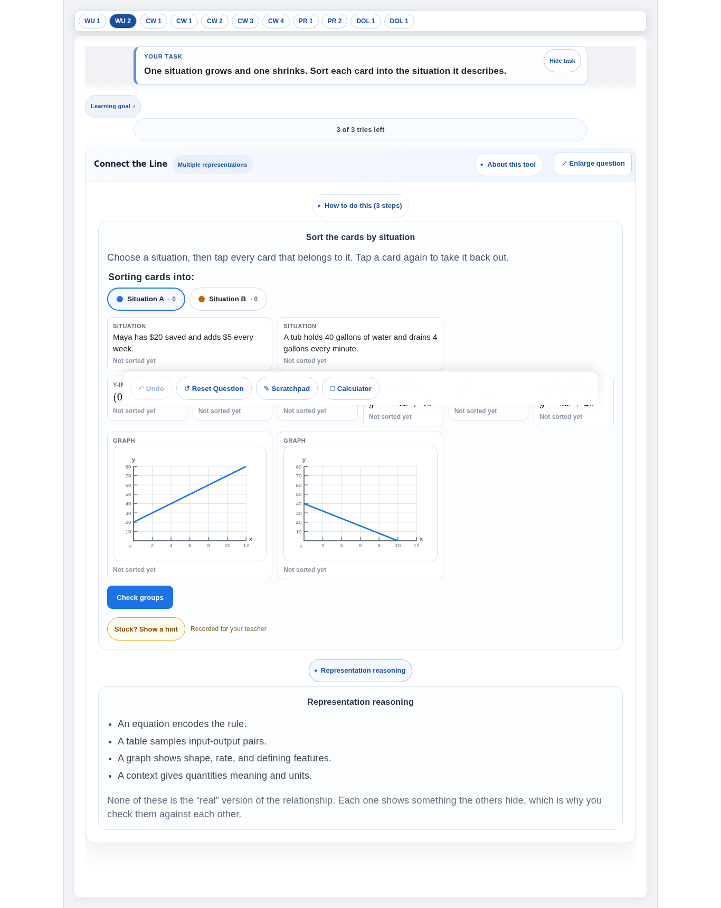 |

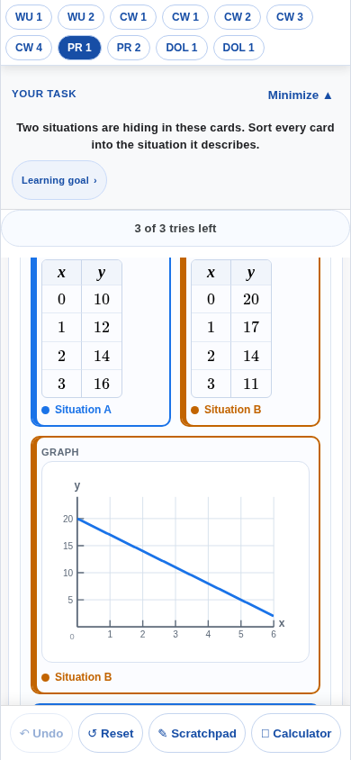

## R-10 · Student-facing platform jargon

**Reproduction.** Under every assignment task: "**TEKS A.3B ›**" and
"**CCMR connection · 4 assessments ›**". Two reporting codes a student cannot
act on, and a second line of the phone's task panel.

**Decision.**

| Audience | Gets |
| --- | --- |
| Assignment question (student; also a teacher's "view as student") | One chip, **"Learning goal ›"**, opening the same dialog. It holds the skill in plain words, the TEKS code named as the teacher's reporting code, and "See where this math appears after this course" one button away. An exam-format chip ("SAT practice") stays: it tells the student what format they are in. |
| Teacher views, a teacher repairing a question (`teacherRepairPreview`), My Math Path skill cards and secure exam review | Unchanged. Those surfaces are organised around the codes, and earlier product work made them clickable deliberately. |

Nothing is removed; it is translated and folded, and the row is shorter.

**Files.** `StandardBadge.jsx` (`audience`), `QuestionEngine.jsx`.

## R-11 · "Show math tools" clutter

**Reproduction.**

- The board had **seven** "Show math tools" pill rows, one under every field.
- On touch devices a visited field's keypad stayed open, and the multi-answer
  grader opened one on arrival for every field needing a fraction.
- The three-part question on a phone opened with **1143px** of workspace on
  `main` before anything was touched.

**Fix.**

- The toggle is a compact **√x** button **on the field's row**, with the same
  accessible name ("Show math tools" / "Hide math tools"), `aria-expanded`,
  `aria-controls` and a 44px target. Pressing it keeps the caret in the field.
- On touch devices the keypad, and the "Needed for this answer" keys, show
  **only while that field is being typed in**. Tapping √x from outside the
  field puts the student in it.
- The keypad closes when the student moves to another field, input or
  select, **not** when they tap a button: closing it on a tap moved the Check
  button below it out from under the finger (caught by PR #397's phone
  journey).
- Desktop keeps the student's choice and any authored open-on-arrival.

**After (same harness).**

| Measure | main | this branch |
| --- | --- | --- |
| Board page at 1366×768 | 2609px | 2505px |
| DOL board page at 1366×768 | 2614px | 2458px |
| Three-part answer on a phone, workspace on open | 1143px | 598px |

One keypad is open at a time.

**Evidence.** Journey `phone`; `mathInputToolsToggle.test.mjs`.

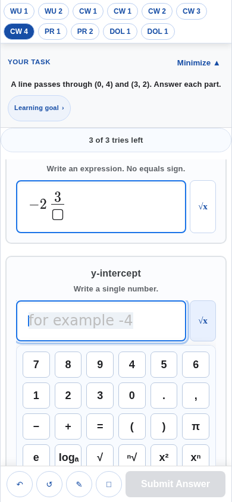

## R-12 · Enter behaviour (P0)

**Reproduction.** Every registry tool was mounted and Enter pressed in each
box after typing a value (`onAction` recorded):

| Tool | Before: Enter in the first of several boxes | After |
| --- | --- | --- |
| Parabola Geometry | **submitted an attempt** (3 boxes still blank) | moves to the next blank; in the last box, focuses *Check features* |
| Complex Plane | **submitted** | next blank → focus *Check* |
| Relation Mapping | **submitted** (Range blank) | next blank → focus *Check* |
| Exponential/Log | **submitted** | next blank → focus *Check* |
| Constraint Builder | **submitted** | focus *Submit this model* |
| Function Operations | **submitted** from any of 5 boxes | walks the 5 boxes → focus *Check all operations* |
| Data Modeling | **a field in one panel submitted the whole lab** | next blank → focus *Check data model* |
| Inverse Composition, Sequence Explorer (one box) | submitted | still submits (single-answer convention) |
| Interval Number Line | submitted from the notation box | unchanged (it is that panel's only box) |

**Contract** (`answerEntryUx.js`). Nothing is guessed from button text any
more.

- **A tool declares** the button Enter may use:
  - `data-mm-enter-action="card"` acts on the field's card. It is pressed
    once the card is filled in.
  - `"submit"` (or the legacy `data-primary-answer-action`) submits the
    question. It is pressed only from the **one** answer box in its scope;
    otherwise Enter **brings it into focus**, and a second, deliberate Enter
    presses it.
- The scope is the nearest `[data-mm-enter-scope]` or tool panel. A declared
  button outside the field's scope is used only if it is the tool's only one,
  and never pressed from there.
- A box left empty makes Enter move to the next empty box. Enter in the empty
  box does nothing, and two declared actions in one card do nothing.
- **Question level** (`resolveQuestionEnterIntent`):

  | State | Enter does |
  | --- | --- |
  | Incomplete | Moves to the next empty box |
  | One box, complete | Submits (kept) |
  | Several boxes, a DOL or a one-try item | Focuses Submit; a second Enter submits |

- Fields that own Enter (MathInput `onSubmit`, e.g. Step Algebra rewrites,
  systems elimination) are marked `data-mm-enter-owner` and left alone.
  Textareas, selects, radios and the calculator keep Enter throughout.
- **Stale render.** "6⏎" typed quickly reached the engine before the render
  that recorded the 6. The engine now decides a few frames later from fresh
  state, with the Submit button's own gates. Found by the `enter` journey.
- Declared: the whole-question checks of 17 tools, and RepresentationBridge's
  five stage checks as `card` (no attempt).

**Evidence.** `enterContract.test.mjs` (fake-DOM resolver cases,
mutation-checked); journey `enter`:

- three-part answer: Enter walks the blanks, then focuses Submit (no grade);
  a second Enter submits;
- one-box answer submits on Enter;
- DOL waits for the second Enter;
- board: Enter checks the slope card, no grade;
- LTW: Enter in *Slope m* moves to *y-intercept b*, no attempt.

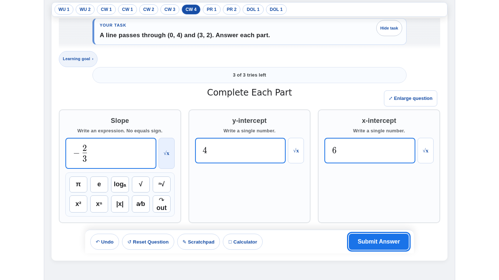

## R-13 · Reduced zoom / wide screens

**Reproduction.** The app is a **1126px column** (`#root` in `index.css`,
since the initial commit), and the assignment shell is 1120px. So a
Chromebook zoomed out to about 70% (1920×1080 CSS px) showed a third of the
screen empty; ToolShell's own 1180px cap never came into play.

**Fix (opt-in).**

- `ToolShell widthProfile="wide"` (1480px).
- At ≥1400px, `App.css` lifts `#root` and the assignment shell **only while a
  wide-profile tool is on screen**. The task card keeps its 1120px reading
  width and the action bar its 900px; teacher screens and ordinary questions
  are unchanged.
- The board (three card columns, via a container query, when there's room)
  and the card sort opt in.

**After (1920×1080, page height, same harness).**

| Question | main | this branch |
| --- | --- | --- |
| Board | 2627px | 2439px, with bigger graphs |
| WU-1 sort | 2002px | 1589px |
| Three-part answer | shell 1084px | shell 1084px (unchanged, as intended) |

**Evidence.** Journey `wide`; `toolShellWideProfile.test.mjs`.

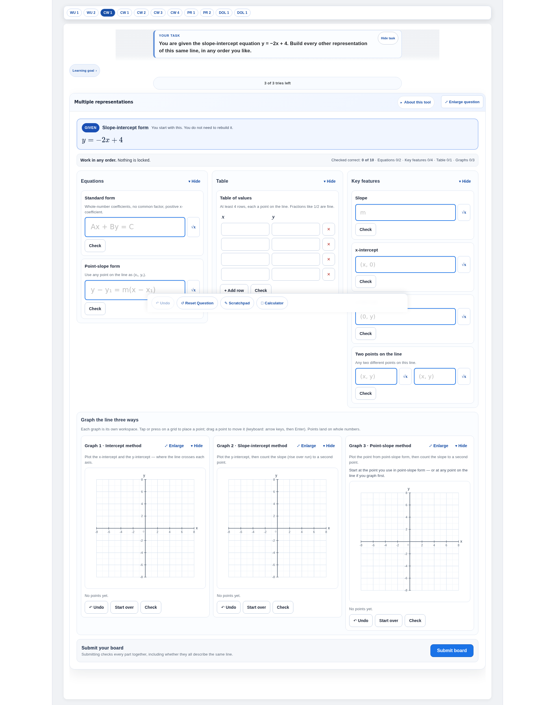

**Follow-up.** Other multi-column tools (Systems Workspace, Data Modeling Lab,
Linear Table Workbench) are candidates. Each should opt in only after
checking that its layout actually loses height.

## R-14 · Undo consistency

**Reproduction.** On the board each graph had its own Undo, while the action
bar's Undo, the one every other question uses, was **always disabled**. Two
Undos, one of which never worked.

**Fix (B).**

- The board registers with the platform Undo (`useActiveUndoOwner`). It takes
  back the **most recent graph change on whichever graph**, popping the same
  per-graph history the graph's own Undo pops, so the two can never disagree.
- Its title names the graph ("Undo the last change on Graph 2").
- The cross-graph order lives in a ref, like the histories, so the synced
  draft is untouched.

**Evidence.** Journey `graphs`: plot on Graph 1 and Graph 2, platform Undo
empties Graph 2 first; the graph's own Undo takes back a drag.
`boardPlatformUndo.test.mjs`.

**Deferred (C): one Undo history for the whole board.**

- **Now:** the platform Undo covers the graphs; typed answers keep MathLive's
  in-field undo (Ctrl+Z).
- **Affected:** `LinearMultipleRepresentationsBoard.jsx`,
  `useMathUndoHistory.js`, `persistedMathUndo.js`.
- **Contract:** the board passes its whole mathematical record (equations,
  features, table rows, graph points, context choices) to `useMathUndoHistory`
  with `ownerId: 'lmr-board'` and `persist: true`. `onRestore` writes every
  field back. The graph buttons become "Undo" on the same history filtered to
  that graph's key.
- **Migration:** replace `historyRef` / `editOrderRef` with the hook; keep the
  per-graph buttons as views of the shared stack.
- **Testing:** the `graphs` and `persistence` journeys, plus a node test that
  a restored entry never contains verdict fields.
- This touches every card of a board that just shipped, which is why it
  belongs in its own PR.

---

## Student walkthrough

Asked on every question at every viewport, answered from the journeys and
screenshots:

| Question | Now |
| --- | --- |
| Do I immediately know what to do? | The task card leads. The chrome under it is one "Learning goal" chip. The card sort names what is being sorted. |
| Is my work visible? | Laptop: focus scrolling clears the measured bar. Phone: the typed box sits above the keypad, the bar is one row, and only the active field's keypad is open. |
| Is any button covering my work? | No. The phone bar yields to the keypad; the desktop bar is accounted for in scroll padding. |
| Did the keyboard appear before I wanted it? | Not on iPad or phone, on any question. |
| Did Enter do what I expected? | Next blank, then Submit into focus. One-box questions submit. No attempt was spent by a first-box Enter in any tool. |
| Did the right field receive my typing? | Yes, including at 4× CPU throttle. |
| Can I type a negative number / a fraction on mobile? | Yes: ± and a fraction bar on the keypad; −2/3 lands in the box and the draft. |
| Is math displayed like classroom mathematics? | LaTeX with spacing and braces renders. Card equations are 20px typeset math. |
| Am I reading repeated instructions? | One line of plotting directions per tool. The board's own sentence is kept once. |
| Is there unnecessary jargon? | TEKS/CCMR codes are folded into "Learning goal" on assignment questions. |
| Do I have to scroll because controls are duplicated? | No "Show math tools" rows; one keypad at a time on touch. |
| Can I find the graph controls? | Under each plane as before; zoom buttons stay visible; keyboard help is one tap away. |
| Does the interface jump after feedback? | No page jump on open. Enter focusing Submit scrolls it into view only when needed. |
| Is the active answer field obvious? | The focused field has the ring and, on touch, the only open keypad directly under it. |
| Can I recover from mistakes? | The platform Undo works on the board. Enter never submits a half-filled question. Drafts restore after reload. |

## Responsive review

| Viewport | Findings (after) |
| --- | --- |
| 1366×768 laptop | Nothing jumps on open. One-box answers autofocus. Bar 65px, padding 83px. Board, sorts and graphs within the 1120px shell. |
| 820×1180 iPad (touch) | Laid out like a laptop (by width) but **no autofocus, no keypad on arrival**. The board's √x keypads open only when a field is tapped. |
| 390×844 phone | One-row bar with Submit (61px). Fraction key and ± on the number keypad, with the box above it. One math keypad at a time. Two facts per row in the sort. No sideways scroll on the sort, board or LTW. |
| 1920×1080 (reduced zoom) | The board and sorts use up to 1480px with the task at 1120px; ordinary questions unchanged. |

## Keyboard and focus review

- **Autofocus** is decided once (QuestionEngine) and obeyed by tools. There is
  no autofocus on touch-first devices; a tool focuses only its one answer box.
- Programmatic math-field focus never scrolls the page.
- Clicking a math field moves keyboard focus in the same event. A key cannot
  edit a field MathLive has left.
- `EnlargeableFigure` returns focus only after a real close.
- Enter contract: see R-12. Tab order is unchanged.

## Math input review

- **Fraction entry:** the phone keypad has a fraction bar on boxes that grade
  fractions. MathLive fields keep their a⁄b key.
- **Negatives:** ± starts a negative on an empty box. A number input is never
  given a bare "-".
- **Math tools:** a √x button beside the field (desktop toggle). On touch,
  the active field's keypad only.
- **Backspace:** a stale field can't consume it (R-4). The keypad's ⌫
  unchanged.
- MathDisplay renders every backslash command as LaTeX (R-3).

**Observed, not changed:** the multi-answer grader's "Write a single number."
box offers the full expression pad (π, e, log, √) on a phone. That's the
field's authored `toolProfile`, and a candidate for the numeric profile.

## Graphing review

- Mathematics clipped to the plot box at every size; axis numbers, points and
  handles never clipped (R-8).
- One line of directions per tool (R-7).
- The board's platform Undo and per-graph Undo share one history (R-14).
- Plot, drag, enlarge and Undo driven in the `graphs` journey. The PR #397
  board journeys (plotting, dragging, enlarging, snap steps, Graph 3 anchors)
  were re-run on this branch; see Tests.

## Persistence review

- The `persistence` journey types, plots and fills on three questions,
  reloads, and gets everything back. All stored records (9) pass the real
  sanitizer, and the development audit refused nothing.
- The registry sweep found no refused record in 23 tools (R-5).
- Nothing new is persisted by this PR except fields students type. The board
  Undo order lives in a ref, and fraction entry stores the same strings.

## Enter / submit review

See R-12. Summary of guarantees now tested:

1. Enter never presses a button chosen by its words.
2. Enter never submits while a box in its scope is empty.
3. A question or tool with several boxes, a DOL, or a one-try item is
   submitted by Enter only after Submit has been brought into focus and Enter
   is pressed again.
4. The single-answer convention (one box, complete, Enter submits; Enter
   again continues) is kept.
5. A card's own check (board cards, representation-bridge stages) runs on
   Enter from that card only.
6. Textareas, selects, radios and the calculator keep Enter.

---

## Tests

| Gate | Result |
| --- | --- |
| `npm run test:platform` | **6592 / 6592** |
| `node --test tests/tools/*.test.mjs` | **252 / 252** |
| `npm run test:authoring-v5` | **684 / 684** |
| `npm run lint` | exit 0; 449 warnings, identical to `main` (none new) |
| `npm run build` | exit 0 |
| `npm run build:firebase` | exit 0 (build manifest written; nothing deployed) |
| `npm run test:rules` | not run: no Firestore rules or collections changed |
| `tests/browser/studentUxPlatform.mjs` (9 journeys) | **9 / 9** |
| `tests/browser/toolDraftSyncSweep.mjs` | 23 tools, 0 findings |
| PR #397 `linearMultipleRepresentations.mjs` (11 journeys) | **11 / 11**, after one fix in this PR (see R-11) and updating the warm-up journey to R-9's new card names |
| `draftPersistence.mjs` (14 families × navigate/reload/reopen) | all pass |
| `day2NonuniqueJourneys.mjs` | **6 / 6** (Undo found by class after R-1's name change) |
| `stepAlgebraStructureTools.mjs` | no findings |
| `toolOpenAudit.mjs` chromebook / phone / tablet | exit 0; chromebook table identical to `main` |
| `assignmentMobile.mjs` | 3 findings (staged-graph enlarge), **identical on `main`**: pre-existing, not from this PR |

The browser gates ran against a Vite server from this branch. Every
comparison with `main` used a scratch checkout of `86da4e83` served the same
way with the same harness.

New node tests: `enterContract`, `mathFieldFocusHandoff`, `toolDraftSyncContract`,
`numberEntry`, `coordinatePlaneClipAndHelp`, `representationMatchStudentUx`,
`mathInputToolsToggle`, `boardPlatformUndo`, `toolShellWideProfile`, plus
additions to `mathDisplayFormat` and `answerEntryUx`.

Source contracts that pinned wording rather than behaviour were rewritten
against the behaviour they protect, per `docs/handoffs/SOURCE_CONTRACT_PLAYBOOK.md`:

- the 90px scroll padding became "clears the measured bar";
- import-line and JSX-text matches were made order-independent;
- the graph-card span became "graphs never below 260px";
- the focus-signal effect accepts the sink path.

## Remaining platform risks

- The MathLive focus hand-off depends on MathLive internals (`hasFocus`,
  `part="keyboard-sink"`). Re-run `rapid-switch` on any MathLive upgrade.
- Tools that relied on the old text-matched Enter and were not declared lose
  Enter-to-check; Enter does nothing there, which is safe. The declared set
  covers every tool the Enter survey exercised.
- The QA harness is the real runtime without Firebase; the sticky identity
  bar above the navigator is not rendered.
- Wide profile uses CSS `:has()` and container queries (Chrome 105+, Safari
  16+). Older browsers keep the standard width.
- Pre-existing and unchanged: `assignmentMobile.mjs` reports that the
  staged-graph-analysis enlarge panel opens with the graph off screen at
  344–390px. It reports the same on `main`, and its fixture
  (`assignmentMobileFindings.json`) is stale. That needs its own look.
- The accessible name of the action-bar Undo is now "Undo" (the ↶ is
  decorative). Any other script that looked it up by "↶ Undo" must use the
  name "Undo" or the `.mathmaster-universal-undo` class; the one in this
  repository was updated.
- `workViewCertification.mjs` was not run; it times out on this machine on
  `main` as well.
